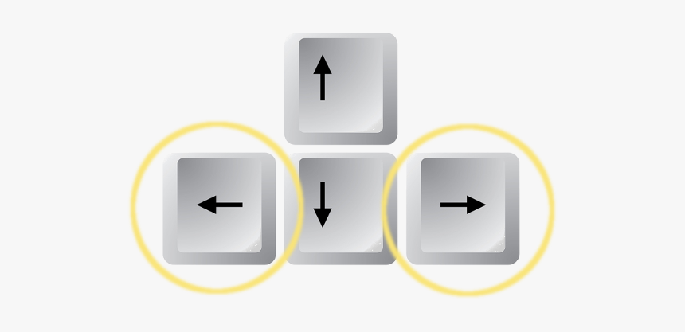

# Tile Breaker Game

## Contributers:

- **Vasvi Agarwal**
- **Sparsh Garg**
- **Nishanth Mohankumar**
- **Tariq Hussain**


## Game Description

This game is a retro brick breaker, where you control a paddle to prevent the ball from falling off the screen while trying to break all the bricks at the top. The game features multiple levels with increasing difficulty, and includes power-ups that affect gameplay, such as increasing/decreasing paddle size or altering ball speed. A leaderboard keeps track of high scores, and players can start a new game, view instructions, or exit.

The game has a nostalgic aesthetic, featuring a starry background that gives a sense of a space adventure as you clear levels, break bricks, and attempt to secure the highest score.


## User Guide


### **Main Menu**


- **New Game**: Start a new game.
- **Instructions**: View information on how to play the game.
- **Leaderboard**: View the leaderboard containing the highest scores.
- **ESC to exit**: Press the ESC key to exit the game.

Use the mouse to select an option from the main menu by clicking on it or pressing the corresponding keys.


### Gameplay Overview
- **Paddle Movement**: Use the Left Arrow key (←) to move the paddle to the left, and the Right Arrow key (→) to move it to the right.




- **Pause Menu**: Press ESC during the game to open the pause menu. Here, you can either resume the game, start a new game, or exit.


### Power-Ups and Special Tiles
- **Paddle Increase**: Paddle size increases, making it easier to keep the ball in play.
- **Ball Speed Boost**: Ball speed increases, making the game more challenging.
- **Paddle Decrease**: Paddle size reduces, increasing difficulty.
- **Ball Slow Down**: Ball speed decreases, providing more control.
- **Extra Life**: Gain an additional life.

### Scoring and Level Progression
- **Score**: Earn points each time the ball hits a brick. The score is displayed at the top left of the screen.
- **Lives**: Start with three lives. Each time the ball falls below the paddle, you lose one life. The game ends when all lives are lost.
- **Level Up**: Destroy all bricks in a level to move on to the next. The game becomes progressively harder, with increased ball speed and a reduced paddle size. A message will indicate level progression.

### Game Over and Leaderboard
- **Game Over**: When all lives are lost, the game ends. Enter your name to save your score to the leaderboard.
- **Leaderboard**: Accessible from the main menu, it shows the highest scores of previous players.


### Instructions
- Use the **Arrow Keys** to control the paddle.
- Use the **Spacebar** to select options from menus.
- Press **ESC** during the game to pause or return to the main menu.

## Background and Visual Elements
The game includes a starry night background, enhancing the visual experience. Each level features different colored bricks, with some special bricks offering power-ups that can aid or challenge your gameplay.


## Tips for Playing
- **Watch for power-ups**: Special tiles provide power-ups that can significantly impact gameplay, either by aiding you with a larger paddle or challenging you with a faster ball.
- **Keep the ball centered**: Try to keep the ball bouncing in the middle of the paddle for better control.
- **Use the stars as reference**: The starry background can help you focus on the direction and movement of the ball.
- **Be ready for level transitions**: Higher levels bring increased speed and a smaller paddle, requiring more precise movements.

Enjoy breaking bricks and setting high scores!

## Compile Instructions

To compile the game, use the following command in the terminal:

```sh
g++ main.cpp fssimplewindow.cpp yssimplesound.cpp ysglfontdata.c -lX11 -lGL -lGLU -lpthread -lasound
```

### Command Explanation:
- **g++**: The GNU C++ compiler.
- **main.cpp**: The main program file containing the game loop and logic.
- **fssimplewindow.cpp**: File providing basic window management functions.
- **yssimplesound.cpp**: File for playing sound effects and background music.
- **ysglfontdata.c**: File providing OpenGL font rendering functionality.

### Linked Libraries:
- **-lX11**: Links against the X11 library, required for managing window systems in Linux.
- **-lGL -lGLU**: Links against OpenGL and GLU, used for graphics rendering.
- **-lpthread**: Links against the pthread library, used for multithreading.
- **-lasound**: Links against ALSA (Advanced Linux Sound Architecture), used for audio playback.

## External Toolkits

### 3.1 FsSimpleWindow
- **Description**: A basic window management library used to create and manage the game window.
- **Source**: This library is part of the provided project files.

### 3.2 YsSimpleSound
- **Description**: A simple sound library for playing .wav files used in the game.
- **Source**: This library is part of the provided project files.

### 3.3 OpenGL
- **Description**: An industry-standard graphics library used to render the game visuals.
- **Download**: Usually pre-installed on most systems. If missing, you can install using the following commands:
  - **For Ubuntu**:
    ```sh
    sudo apt-get install libgl1-mesa-dev libglu1-mesa-dev
    ```

### 3.4 X11 Library
- **Description**: A window system that facilitates interaction with the X Window System. Required for creating the game window.
- **Download**:
  - **For Ubuntu**:
    ```sh
    sudo apt-get install libx11-dev
    ```

### 3.5 ALSA Library
- **Description**: The Advanced Linux Sound Architecture (ALSA) library is used for audio playback in Linux environments.
- **Download**:
  - **For Ubuntu**:
    ```sh
    sudo apt-get install libasound2-dev
    ```

### 3.6 pthread Library
- **Description**: The POSIX threads library used for handling multithreading in sound playback.
- **Download**: Usually pre-installed on most Linux systems.

## Sound Files

### 4.1 Sound Files:
- **bounce.wav**: Sound played when the ball hits the paddle or tiles.
- **bg_music.wav**: Background music played throughout the game.

### 4.2 Download Source:
Both sound files can be found and downloaded from [freesound.org](https://freesound.org).

Note that the .wav files should be placed in the same directory as the game executable for proper playback.

## Additional Notes

### Platform
This game is designed to run on Linux-based systems.

### Game Controls
- **Arrow Keys**: Move the paddle left or right.
- **ESC Key**: Pause or exit the game.

